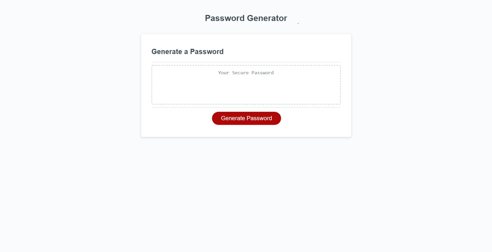

# password-generator

## Description
Tired of coming up with your own passwords? This password generator will do it for you. Just enter the desired password length and select at least one of the criteria, and voila! Your very own brand new password.

## Usage
click on generate password. 
Prompt will ask user how many characters between 8 and 128.
Click ok (to add) or cancel (to exclude) special characters, lower case letters, uppercase letters, or numbers in new password.
User must click ok for at least one.
If all criteria met, new password is generated! 
;

## Credits
Thank you to the instructors and my fellow study group peeps for helping me with this project.

## Badges
